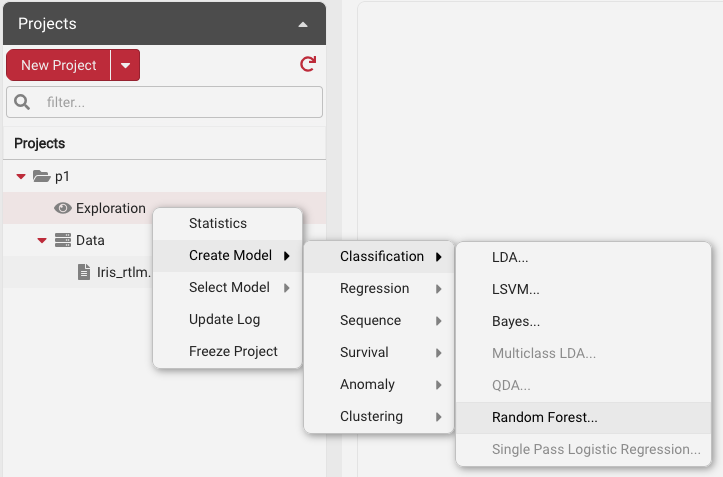
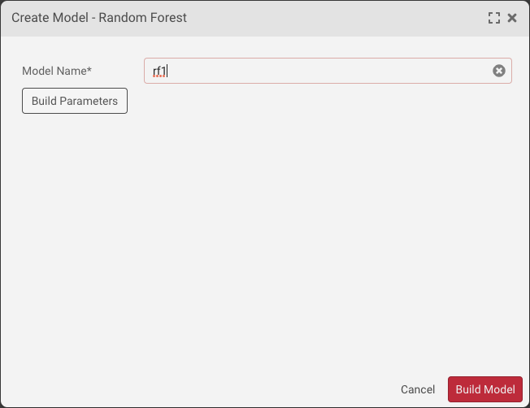
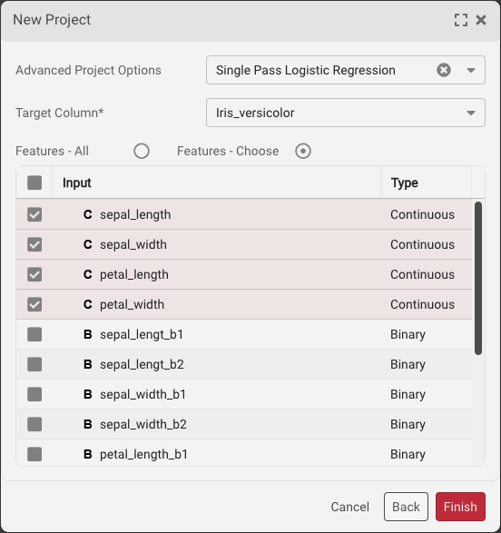
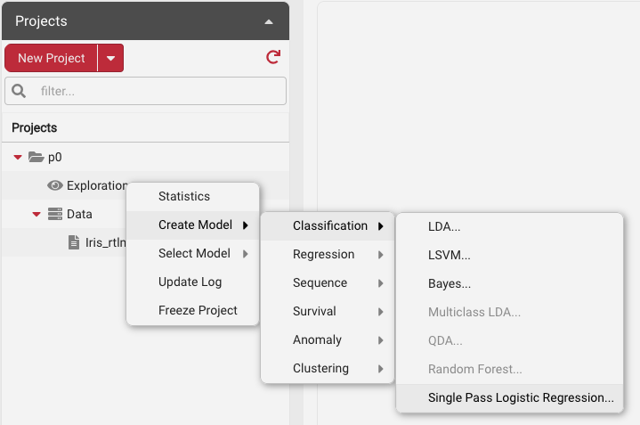
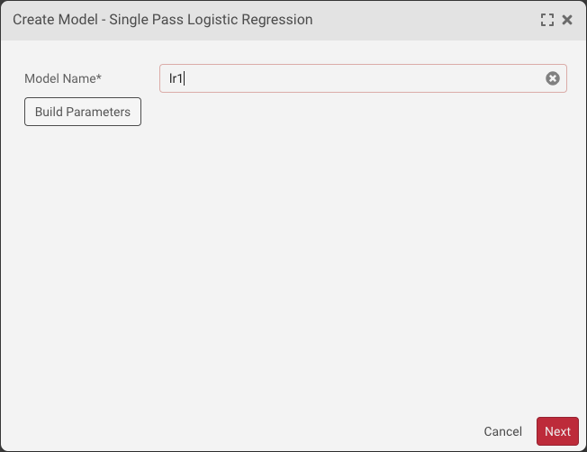
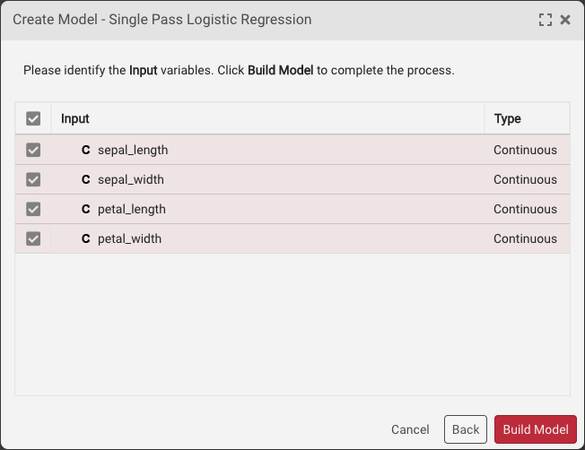
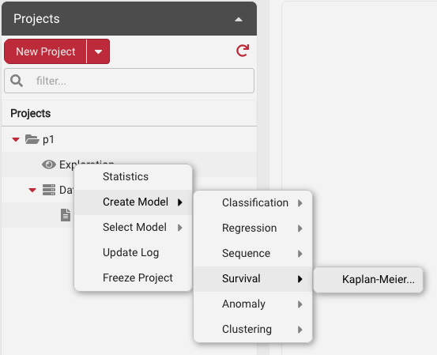
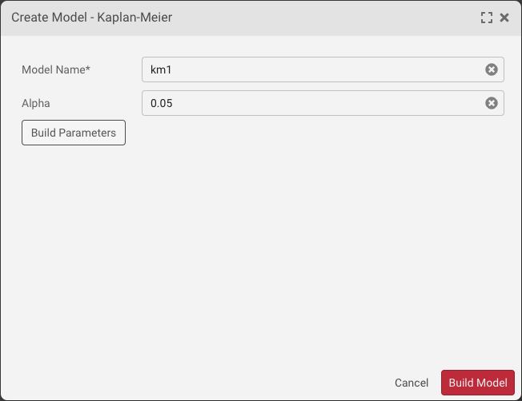

# Projects

## Creating New Projects

Project creation is one of the first steps in performing data analysis within SymetryML. As a user you also have the option of deciding whether the project should be persisted. Disabling persistence will improve the responsiveness of the application but your data will not survive a system reboot. To create a new project:

Expand the **Projects** panel, and then click the **Create Project** button.

Select the appropriate project type.

Assign a new name to your project, optionally assign an encoder to your project or select the order of the sequence. Click **Next** to continue.

Select an existing data source or define a new data source directly from the project wizard.

Ensure that your data is valid.

Click **Next**. The type-mapping panel appears. 7. On the type-mapping panel, verify the data types for the attributes inside the file. You can change the data types to ones that are more appropriate. Click **Finish** to start the project-creation task.

Row Filter option allows you to specify which rows of the data you want to keep. Currently it supports simple boolean predicates. For example, if you wanted to focus on data where `sepal_width` is greater than 3 and `petal_width` is greater or equal to 1, you would use the following rule `sepal_width>3;petal_width>=1`.

After the project creation completes, the change is shown in the project tree.

For more specialized project types, a user has the option of clicking on the dropdown option of the **Create Project** button. This allows one to build one of the following project types:

* **Empty Project** - Project with no data. Data can be added in a separate step.
* **Local Project** - Project local to the SymetryML instance. Same as **Create Project** option.
* **Create Federation** - Create a new Federation.
* **Join Federation** - Join an existing Federation.
* **Fusion Project** - Create a new Fusion project.

## Advanced Project Features

Advanced project features allow you to augment the standard learning behavior for a project. The advanced options are available on the last panel of the project wizard. This augmentation can be as simple as performing dynamic data augmentation, such as the case with [Power Transformation](projects.md#power-transformation) option, or it could allow you to build online models such as Random Forest, Kaplan-Meier, Logistic Regression, or K-means.

### Power Transformation

Enabling power transformation when creating a project allows for the creation of power regression models. See [Power Transformations](symetryml-concepts.md#power-transformation).

When the **Power Transformation** option is selected, the user can specify the range of powers which will be used to transform your target of choice.

In the figure above, we can see that column **y** has been chosen as a candidate for the power transformation. The range of powers that will be created start at **-2** and go up to **2** using five evenly spaced intervals.

### Random Forest

Random Forest can be enabled by the selecting the corresponding option in **Advanced Project Options** drop down. The required fields when selecting this option are :

* RF Classifier - **RF Type**, **Target Column** and **Number of Classes**
* RF Regressor - **RF Type** and **Target Column**
* RF Anomaly - **RF Type**

The inputs of the model can also be specified. If left unselected all of the inputs will be used.

Clicking **Finish** will start the project learn and fit the RF model.

After the project has finished learning, the final steps in creating the RF model involves:

Right clicking on the **Exploration** icon, and selecting **Random Forest** from the **Create Model** menu.

Giving your model a name.

Clicking **Build Model** button.

### Single Pass Logistic Regression

Logistic Regression can be enabled by the selecting the corresponding option in **Advanced Project Options** drop down. **Target Column** is the only required field for Logistic Regression. The target column must be specified before the project learn action and cannot be changed afterwards.

Optionally, you can select the initial pool of attributes with which you can build your Logistic Regression (LR) model. After the project has finished learning, you can build the LR model by right clicking on the exploration icon and choosing **Single Pass Logistic Regression**.

Ensure you model is assigned a valid name. Click **Next** to continue.

Lastly, you can select the final set of input attributes for your model from your initial pool. Click **Build Model** to complete the process.

### Kaplan-Meier

To enable Kaplan-Meier model, the corresponding option needs to be selected in **Advanced Project Options** drop-down.

The required fields when selecting this option are : **Time Column**, **Event Column** and **Group Column**

Clicking **Finish** will start the project learn and fit the KM model.

After the project has finished learning, build the KM model by:

Right clicking on the **Exploration** icon, and selecting **Kaplan-Meier** from the **Create Model** menu.

Giving your model a name.

Clicking **Build Model** button.

### Clustering

To build a clustering model, a project needs to be created with a specific set of parameters. These parameters can be enabled as part of the **Advanced Project Options** on the last page of the project wizard.

| Parameter                  | Required/Optional? | Description                                                                                                                                                                                                                                                                                                                                                                                                                                                                                                                                       |
| -------------------------- | ------------------ | ------------------------------------------------------------------------------------------------------------------------------------------------------------------------------------------------------------------------------------------------------------------------------------------------------------------------------------------------------------------------------------------------------------------------------------------------------------------------------------------------------------------------------------------------- |
| **Cluster Seed**           | Optional           | Set the seed of the randomizer                                                                                                                                                                                                                                                                                                                                                                                                                                                                                                                    |
| **Cluster Features**       | Mandatory          | The features to use for the clustering algorithm.                                                                                                                                                                                                                                                                                                                                                                                                                                                                                                 |
| **Cluster Max Iterations** | Optional           | Default is **1000**. This control the number of iterations of the KMeans algorithm.                                                                                                                                                                                                                                                                                                                                                                                                                                                               |
| **Cluster # Centroids**    | Optional           | Default is **100**. This parameter control the number of centroid that are kept in real time on the data. Typically this number is much higher than the intended number of cluster - e.g. the target _k_ parameters                                                                                                                                                                                                                                                                                                                               |
| **Cluster Warmup Period**  | Optional           | Default is **101**. This parameters control how many tuples of data must be seen before the initial real-time cluster will be constructed using the _cluster\_num\_centroids_ parameter as the k number. Once the initial cluster is created it will just be updated in real-time with each new tuple/row of data. Note that **Cluster Warmup Period** needs to be greater than **Cluster # Centroids**, e.g. **Cluster # Centroids**=100 and **Cluster # Centroids**=101. If this condition is not meet an error will be raised by the software. |

Once a cluster project is created, building the model is as simple as right click on the **Exploration** icon and selecting the corresponding option.

The above process assumes that the correct number of clusters is known ahead of time. This is typically not the case. Cluster selection is an iterative process during which a number of different models will be built and evaluated.

**K-Means Select** is a feature that enables you to perform this analysis in one simple step.

First, select the **K-Means Select** option under the **Exploration** menu.

Select the appropriate range of clusters to evaluate.

You will be notified of the results once the **Optimize K-Means Job** is complete.

The result of the optimization process is a set of two graphics which allow you to compare the **WSSSE** and the **Silhoutte Scores** across different models.

You can complete the process by choosing the optimal number of clusters and clicking on the **Build Model** button.

## Federated Projects

Federated projects allow you to create a collaborative network of SymetryML nodes which leverage external data while preserving data privacy. A full tutorial of Federated Learning can be found in the [Federate Learning](../federation/#introduction) section.

## Fusion Projects

Creating a Fusion project is a slightly different process than creating a local project. Because fusion project does not learn any data itself and only amalgamates information from other projects, it is important to know the host address and the user credentials for the SymetryML nodes that contain the actual source projects.

To begin creating the Fusion project:

Click **Fusion Project** in the project type selection dropdown menu.

Set your fusion **Project Name**

Fill out the **Host**, **User ID**, **User Secret Key**, and **Project Name** of your cell project.

Click **Add**

Repeat Step 3 and 4 for any additional cell you wish to include.

Click **Validate** to ensure that the fusion cells are accessible.

Finally, click **Create** to complete the process.

Should you need to edit the information in your Fusion project, you can simply right click on the **Fusion** node and click **Fusion Info**

From here you are able to add and remove cells as you see fit.

## AutoML

AutoML streamlines various stages of the typical machine learning pipeline. Enabling this feature will automatically filter out redundant features, engineer new ones, and allow the project to focus on a specific attribute. AutoML is meant as a precursor to [Model Select](models.md#model-select). Utilizing the two steps in sequence allows the user to quickly build up models with minimal data preprocessing.

AutoML can be enabled on the last panel of the **New Project** wizard.

## Project Properties

Existing project properties can be viewed by simple right clicking on the project of your choice and selecting the **Properties** option.

Your project properties will be displayed in a separate window.

## Exploring Projects

After you create your project, you can access multiple forms of univariate and bivariate methods of analysis.

1. Double-click the **Exploration** icon in the project tree.
2. Click the tab corresponding to the task you want to perform.

## Adding Data to Projects

You can augment an existing project with additional data at a later time. For example, you can use this feature with an output of a weekly ETL process that constantly updates the file for use within SymetryML.

1. Right-click the **Exploration** node of your project tree.
2. Click **Add Data.**
3. Specify whether you are using an existing or new data source, and then click **Next** to continue.
4. Inspect your data to ensure it was read properly. Click **Next** to add the data to your project.

## Learning and Forgetting

After you add a new data source to your project, you can either learn from this data or forget the records.

To learn a newly added data source, right-click the data-source node in the project tree, and then click **Learn**.

To forget a data source, right-click the data source node in the project tree, and then click **Forget**.

## Update Log

All the data source updates to a project are tracked in the Update Log. Here you can see the number of records processed for each data source and the time it took to process them.

Update Log can be displayed by right clicking on the **Exploration** node and selecting **Update Log**.

## Renaming Projects

You can rename a project at any time.

1. Expand the **Projects** accordion. Right-click the exploration node, and then click **Rename Project**.
2. Enter the new name, and then click **OK** when finished.

## Merging Projects

Two projects can be merged. This process involves transferring all the learned data from the source project into a destination project. To perform a project merge:

1. Right click on the destination project icon.
2. Select **Merge Project** from the contextual menu.
3. After the **Merge Project** wizard appears, select the source project.
4. Click **Finish**

The destination project will now be updated with the metadata of the source project.

## Exporting/Importing Projects

Projects can be transferred between various SymetryML hosts via the export/import capabilities. Export is available for most project types with the only two exceptions being :

* Federated Projects
* Fusion Projects

Federated projects have an internal mechanism for transferring their data between various nodes in the federation. Fusion projects do not contain any data themselves and query their individuals cells dynamically.

### Export

To export a project, simply right click on the project and select **Export Project**

After specifying the project name. The project file can be saved locally by pressing the **Download** button

### Import

Importing a project involves clicking on the **Create Project** dropdown and selecting the **Import Project** option.

The user is then able to browse for a local project file and, after supplying the name for the imported project, click **Import** to complete the process.

## Deleting Projects

If you no longer need a project, you can delete it. When you delete a project, all accumulated metadata and models related to the project are also deleted. However, associated data sources and encoders will still be available.

1. Expand the **Projects** accordion. Right-click the project node, and then click **Delete**.

## Freezing Projects

Project state can also be temporarily frozen. This prevents the project from performing any additional learning or forgetting. Once it is deemed necessary to revert to the standard learn/forget behavior, a project can be unfrozen.

## Sync Project

Because a SymetryML project can be altered in both GUI and via a REST API call, it is often beneficial to synchronize your project. This action ensures that the representation of the project on the SymetryML server aligns with what the user sees in the SymetryML GUI.

## Detaching Data

Data can be detached from a given project. Note, this will not “unlearn” the data source. It simply disassociates the data from the project.

## Managing Memory

SymetryML Projects are permanently persisted inside a fast access in-memory database. However, direct interaction with the Projects, either though learning, model building or prediction, requires the Project to be loaded into the memory of the JVM process.

Over time, as the number of projects grow, the physical memory of the machine hosting the SymetryML process will become exhausted. In this case, it becomes necessary to manually manage the memory consumption of the JVM process.

Within the SymetryML GUI, you are able to unload the chosen project and reduce the physical memory requirements of the SymetryML process.

Unloaded project will be displayed as the lighter version of its in-memory counterparts. Loading the project back into JVM memory can be performed by either double-clicking on the corresponding icon, or right-clicking and selecting **Load Project**.
