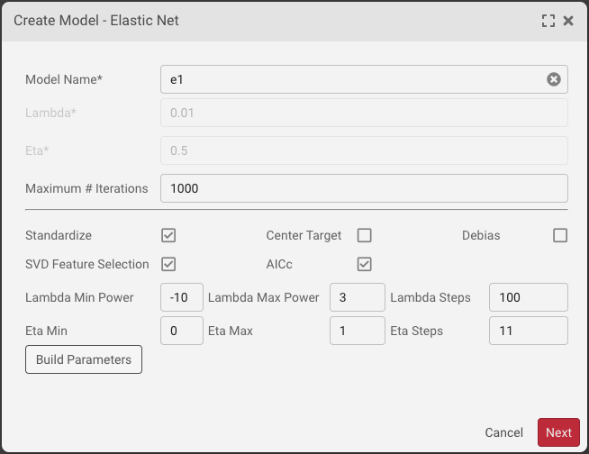
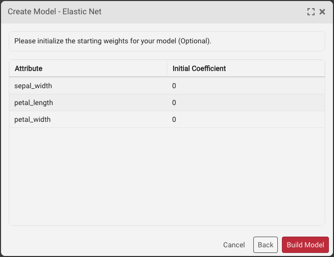
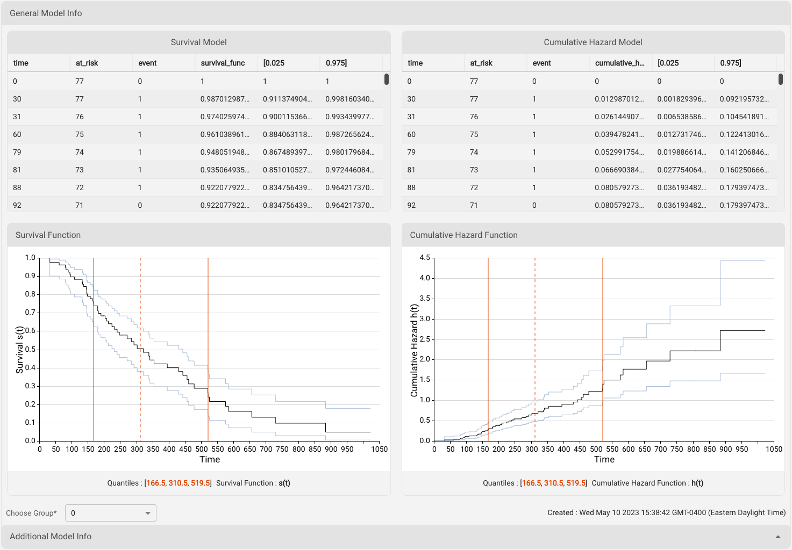
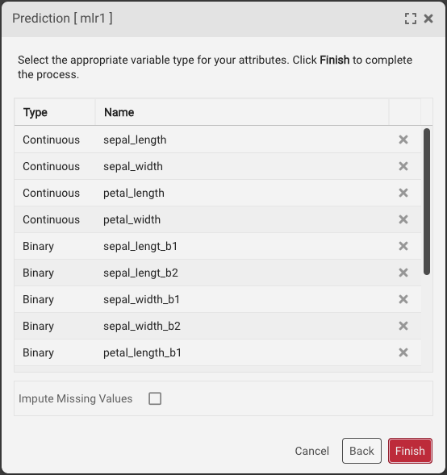

# SymetryML Concepts

## Working with SymetryML

SymetryML offers users two ways to access its core functionality:

* SymetryML GUI
* SymetryML REST Client

SymetryML offers a complete GUI for accessing the most common functionality. It allows you to add data, learn, and build predictive models on that data. Most functions available in SymetryML GUI can be replicated via individual service calls to SymetryML REST.

For a detailed description of SymetryML REST Client and how it can help you simplify deployment, refer to the [_SymetryML API Reference Guide_](../../symetryml-rest-client/rest-documentation/).

## Authentication

Authentication with the SymetryML application is achieved using a predefined user ID and security key. The randomly generated security key was given to you when you initially registered for the application.

If this is your first time registering, use the user ID **admin** and user secret key **admin**. Click **Sign In**. The system redirects you to the registration section of SymetryML GUI that will guide you through the registration process. The process of generating these credentials is described in [_SymetryML Admin User Guide_](../../guides/untitled.md).

## SymetryML GUI

After you log in to SymetryML GUI, the SymetryML GUI interface appears (see below). This interface allows you to fully leverage ML Toolkit functions.

The interface is organized into three components:

* Main accordion
* Contextual panel
* User admin panel

Within these panels, you can interact with various ML Toolkit objects, such as models, data sources, and encoders.

### SymetryML GUI Component Description

| UI Component      | Description                                                                                                                                                                                                                                               |
| ----------------- | --------------------------------------------------------------------------------------------------------------------------------------------------------------------------------------------------------------------------------------------------------- |
| 1. Main Accordion | Provides a quick overview of data sources, encoders and current projects.                                                                                                                                                                                 |
| 2. Contextual     | Details about specific SymetryML objects can be viewed in a contextual panel. For instance, double-clicking a learned project object shows summary statistics, and allows you to perform hypothesis testing and analysis of variance (ANOVA) exploration. |
| 3. Job Status     | Provides information about the status of currently running jobs.                                                                                                                                                                                          |
| 4. User Admin     | Shows the active user and the current version of the SymetryML application. This panel also notifies you about version updates.                                                                                                                           |

### Main Panels

| Panel        | Description                                                                                                                                                                      |
| ------------ | -------------------------------------------------------------------------------------------------------------------------------------------------------------------------------- |
| Projects     | Provides access to the heart of SymetryML: the Symetry project. Here you can learn and explore new data, build and evaluate your models, and make predictions.                   |
| Data Sources | Expand to show a general overview of the data sources currently registered with SymetryML. This allows you to validate and delete various data sources used within your project. |
| Encoders     | Allows you to access additional information for the encoders you might have created.                                                                                             |
| Status       | Lists jobs running on your SymetryML server.                                                                                                                                     |

## Data Sources

The first step when working with SymetryML is to define a data source. Data-source objects are typically flat text files stored at a remote location. The remote location can be any of the following : SFTP, Local, Amazon S3, Google Cloud Storage, OCI, Azure Blob Storage, HTTP/HTTPS, JDBC, Redshift.

The desired target attribute must be either binary or continuous. Categorical target attributes should have their values recoded into corresponding binary indicators.

After registering a particular data source with SymetryML, you have everything you need to learn from the newly added data.

For more details on how to create data sources please refer to the [Working with Data Sources](data-sources.md) section.

## Streams

Streams are a dynamic and constantly changing source of data. Unlike their flat file counterparts, streams do not have an end. SymetryML currently supports Kafka Streams. More information about Kafka streams can be found [here](https://kafka.apache.org). Please also consult the [Working with Streams](streams.md) section of this document.

Once associated with a particular project, streams enables the project to learn new data as it becomes available in a continuous fashion without user interaction.

## Symetry Job

Most interactions with SymetryML involve launching a background process on the Symetry server. To view the currently running jobs and their progress, click the **Job Listing** button.

Processor-intensive jobs often prevent other jobs from starting. This is normal and helps ensure the running stability of the SymetryML server. Additional Job information can be retrieved by clicking on the **?** button of a particular job.

## Encoder

In data mining, the process of transforming a categorical attribute into a continuous attribute is called _encoding._ Within SymetryML, an encoder object allows you to transform high-cardinality attributes into meaningful data points that are more predictive than their original form. Because certain modelling algorithms have strict requirements for the type of inputs they accept, an encoded attribute is more flexible in nature than its categorical counterpart.

The current version of SymetryML supports two types of Encoders:

* Probabilistic Encoding - A method which replaces a categorical value _x_ with a probability value of positive target value given _x_, or `P(target=1 | X=x)`
* Feature Hashing - an implementation of the [hashing trick](https://en.wikipedia.org/wiki/Feature\_hashing) approach to encoding **String** values

## Project

Within SymetryML, a project is a top-level container for a collection of data files, models, prediction results, and assessment results. While no particular convention is enforced, we recommend that the project contain elements closely related to a particular data-mining initiative. In practice, this means that each project should focus on a related set of data.

The following sections provide a brief description of the types of projects SymetryML provides.

### CPU

Computation is performed on the CPU. Most common choice for small to medium sized data sets.

### Sequence

Computation is performed on the CPU. Used for sequence data sets.

### GPU

Available if the environment is GPU enabled. Computation is performed on the GPU. Provides improved performance over CPU based projects with very wide datasets (i.e.large amount of features)

When creating a New Project, the first window will require a choice of Project Type. If you only have access to 1 GPU, simply select the `GPU` option, and select `Next`. If you have access to, and wish to utilize, more than 1 `GPU`, then select the `Multi-GPU` option, and then fill out the `Num. GPU*` that you will be utilizing:

### Multi-GPU

Available if the environment is GPU enabled. Reserved for the widest possible datasets. Multi-GPU projects cannot be persisted. SymetryML allows the Multi-GPU project to be of backed by either **float** or **double**. Use of doubles is recommended as they offer higher levels of precision. However, the extra precision does come with a greater memory footprint.

### Partition

Allows for a more specialized approach to learning your data. This is done by partitioning the internal representation on the categorical column of your choice. For multiclass classification problems, a partitioned project will generally produce more accurate representation. However, the improved performance does come at the price of additional memory overhead. As a rule of thumb, partitioned project will take up **N** times more memory as their CPU/GPU counterparts, where **N** is the cardinality of the partition column.

### Power Transformation

Linear regression assumes that the target attribute is normally distributed. While in real world scenarios this is often not the case, we can still improve the performance of the regression model by transforming the target into something resembling a normal distribution. The method of transforming that is used within SymetryML is the Yeo-Johnson transformation.

A SymetryML project, with power transformation enabled, will automatically create new features representing various power transformations of the target attribute. These additional target features will have a prefix and separator to easily pinpoint them. (e.g `pt_sepal_width^-2.0`, `pt_sepal_width^-1.8`, `pt_sepal_width^-1.6`, …, `pt_sepal_width^1.8`, `pt_sepal_width^2.0`). It’s possible to configure the prefix and separator - `pt_` and `^` in our previous example. Please refer to the [Power Parameters](../../symetryml-rest-client/rest-documentation/modeling-api.md#power-regression-parameters) table for details.

Once a project has learned these transformations, a Power Regression model can be build which would select the optimal transformed target.

### Online Models

While the majority of the models in SymetryML can be build after the project has learned, Kaplan-Meier(KM), Random Forest(RF), Single Pass Logistic Regression (SPLR), and Real Time Clustering (RTC) must be specified before any data has been processed. This allows SymetryML to process the data and fit the models in one pass. Subsequent will provide additional information of each type of online model.

#### Kaplan-Meier

Kaplan Meier(KM) is a survival model which can estimate a survival function from lifetime data. With the aid of the survival function, it is possible to estimate the probability of an adverse event not occurring after a specific point in time. The most common usage of such models occurs in the field of clinical trials where a researcher might be interested in the probability that a patient will survive beyond some time _t_.

To build the KM model, your data must be contain the following types of columns:

* Time column - integer valued column representing discrete time.
* Event column - binary column coded in a way where 1 represents an event occurring and 0 represents the subject leaving the study.
* Group column - An column which will partition the model and compute a separate survival function for each member of the group

#### Random Forest

Random Forest is an ensemble algorithm which builds and aggregates the output of multiple decision trees into a single prediction. Current version SymetryML supports classification models in binary and multiclass forms as well as regression and anomaly models. As with other Online Models, RF parameters must be specified at the beginning of the project creation process. See section on [Random Forest](projects.md#random-forest) for additional details and the specifics of the parameters required.

#### Single Pass Logistic Regression

SymetryML implements a single pass variant of the Logistic Regression. This implementation supports both binary and multiclass classification models. Parameters of this model must be specified at the end of the Project creation wizard. See [Advanced Project - SPLR](projects.md#single-pass-logistic-regression).

#### Real Time Clustering

Clustering within SymetryML can be performed by specifying an initial set of cluster centroid. This number must be larger than the maximum number of clusters you plan on building in your final model. Details on creating a cluster model can be found [here](projects.md#clustering).

### Histogram

Histograms can be enabled for a project at anytime via the REST API. However, in SymetryML GUI they can only be enabled at the beginning of the project creation process. In addition to providing visual information on the attribute inside the project, histograms allow a project to create HBA Models. While the information provided by the histograms can often times be invaluable, they do reduce the speed of project updates. Hence, they should be used sparingly in production environments that require fast learning.

### Fusion

A Fusion project combines the information from multiple source projects in a single place. In the parlance of SymetryML, these component projects will be referred to as fusion cells and the project that aggregates them is the fusion project. The use case which benefits the most from the use of a fusion project is one which contains large amounts of streaming data. In such a scenario having a single node process all of the incoming data becomes infeasible. Instead, the stream would be split amongst several component project nodes(cells) which will handle their share of the data independently. A fusion project would then query these cells and combine their data within itself. The merging occurs behind the scenes and does not require any action from the user. The end result is a fusion project that behaves as if it has processed all of the data by itself. The user is then able to explore the data, build models, make predictions and etc. just like any other project.

| **Use Case**             | **Suggested Project Type** |
| ------------------------ | -------------------------- |
| Sequence/Temporal        | Sequence                   |
| 1 to 250 Attributes      | CPU/Partition              |
| 250 to 10,000 Attributes | GPU                        |
| 10,000+                  | Multi-GPU                  |
| Streaming                | Fusion                     |
| Multi Region             | Federation                 |

## Exploration

After data is added and learned, use SymetryML GUI's explore feature to verify that your project has been processed correctly. In other words, a project becomes _explorable_ after a data source has been added to it and learned. Using univariate and bivariate analyses, you can determine the likely selection of candidate pairs that will provide insight for model building. Within SymetryML GUI, tools for exploratory analysis are accessed via tabs in the contextual panel.

**Auto Refresh** functionality will ensure that your SymetryML GUI client will always be synced with the state of the project on the SymetryML Server. This feature can be disabled to improve performance for projects with large number of attributes.

The **Univariate** panel shows the basic statistics for attributes from a particular data source. View this information as a quick sanity check to validate whether SymetryML interpreted the data correctly.

The **Correlation** panel allows you to perform bivariate analyses on the learned data. This enables you to learn quickly about the degree of associativity between your variables and helps when creating subsequent models. In general, avoid models with highly correlated input variables. For example, if variable A is highly correlated with variable B, choose only one for the final model.

**Hypothesis testing** provides a formal way to determine the effect of various inputs on your continuous target. Using this testing, you can determine whether the difference in the continuous variable is related to the values of the binary variables, or test the difference between groups of continuous variables.

Like a correlation analysis, hypothesis testing is a way to perform a bivariate analysis and assess how variables interact. It is best used to determine if the difference in mean/variance between two groups is statistically significant. For cases where you need to look at the difference between more than two groups, please refer to our section on ANOVA.

Each test can be specified in the following fashion:

* the average/variance of a numerical attribute with a known average/variance
* average/variance of two numerical attributes against each other
* two conditional averages of a numerical attribute given one binary attribute
* two conditional averages of a numerical attribute given two binary attributes

The **Z Test** assesses whether the difference between the averages of two groups is statistically significant.

The **T Test**, like the Z Test, assesses whether the averages of two groups are statistically different from each other when the number of data points is less than 30.

The **F Test** compares the variances of two groups.

**Analysis of variance (ANOVA)** assesses whether the averages of more than two groups are statistically different from each other, under the assumption that the corresponding populations are normally distributed. Use ANOVA to compare the averages of two or more numerical attributes, or two or more conditional averages of a numerical attribute, given two or more binary attributes (two or more categories of the same categorical attribute).

The **Chi-square Test** determines the association between two or more categories. This test compares the difference between the expected contingency table and the observed one to determine the strength of the association between the two categories of interest. The output of a chi-squared test is a probability value that corresponds to the level of association. A p-value that is very close to zero corresponds to a strong dependency between the two categories, while a higher p-value implies a certain degree of independence.

The **Principal Component Analysis (PCA)** identifies the most important components of a given dataset and maps the raw observations onto this new vector space. Variable importance can be inferred by looking at the Eigen vectors generated by this transformation.

Within SymetryML, PCA is enabled shortly after the project completes learning:

1. Click the **PCA** tab.
2. Select the attributes of interest.
3. Click the **PCA** button.

With the help of the **SVD** panel, you are able to perform _Singular Value Decomposition_. This allows you to select potential attributes of interest when you actually want to build a model.

**Information Gain** is a metric that measures the change in information entropy for a specific attribute. In the context of SymetryML, use information gain to find attributes that will provide the best separation for your particular target of interest. Variables with high information gain relative to your target will generally be better predictors than their counterparts with low gain. For example, the following figure shows that values of attributes characterizing _petal width_ play the most important factor in identifying the _Iris Setosa_ species of the Iris plant.

**Variance Inflation Factor** (VIF) allows the user to measure the degree of collinearity between a set of factors. Within SymetryML, VIF can be used to select a set of candidate features for one’s model. Attribute with a VIF value of 5 or greater is likely to have a high degree of collinearity with one of its peers. Consider removing such attribute from your candidate set.

## Models

Unlike most data-mining toolkits, SymetryML separates the tasks of learning and model building into two discrete steps. The classical approach assumes these two steps are synonymous by defining model building within the actual learning phase. SymetryML achieves this separation by scanning the input data in such a way as to defer model creation to a later stage. This allows SymetryML to reduce the memory footprint required to learn large data sets and allows models to be created instantaneously. After the data has been learned, SymetryML can generate classification and regression models.

### Classification Models

_Classification_ refers to the data-mining task of trying to build a predictive model when the target is categorical. The main goal of classification is to organize a dataset into mutually-exclusive groups, so that the members of each group are as close to one another as possible, and different groups are as far from one another as possible.

Types of classification models include:

* LDA - linear discriminant analysis.
* LSVM - linear support vector machine.
* Bayes - Naïve Bayes.
* Single Pass Logistic Regression - See [Advanced Project - SPLR](projects.md#single-pass-logistic-regression).

If the project is partitioned (i.e., split on a particular column), two additional model types become available:

* MetaLDA
* MetaQDA

These models handle the multi class classification problem much better than their regular counterparts.

For projects that are enabled for Random Forest, see [section](projects.md#random-forest), you will gain access to a power powerful set of models which gracefully handle regression, classification and anomaly problems.

* Random Forest (classification)
* Random Forest (regression)
* Random Forest (anomaly)

### Regression Models

_Regression_ refers to the data-mining problem of attempting to build a predictive model when the target is numerical. The simplest form of regression, simple linear regression, fits a line to a set of data.

Types of regression models include:

* MLR - Multi-linear regression.
* LSVR - Linear support vector regression.
* Power Regression - Power regression model
* PLSQ - Partial Least Squares regression
* PCR - Principal Components regression
* Lasso - Lasso regression
* Ridge - Ridge regression
* Elastic Net - Linear combination of Lasso and Ridge regularization

#### Elastic Net Model Parameters

The last three models models are related, with Lasso and Ridge being special cases of the Elastic Net model. Working with Elastic Net models allows the user to specify regularization parameter which help prevent over fitting the training data. The primary parameters, Eta and Lambda, can either be specified directly, or chosen with the help of AICc search algorithm.

| Parameter  | Type   | Description                     |
| ---------- | ------ | ------------------------------- |
| **Lambda** | Number | Lambda parameter of Elastic Net |
| **Eta**    | Number | Eta parameter of Elastic Net    |

Optional parameters for Elastic Net are the following:

| Parameter                   | Type    | Description                                                      |
| --------------------------- | ------- | ---------------------------------------------------------------- |
| **Maximum # of Iterations** | Number  | Maximum number of iteration                                      |
| **Standardize**             | Boolean | Transform each feature to the same scale (Z-score normalization) |
| **Center Target**           | Boolean | Center target around zero                                        |
| **Debias**                  | Boolean | Debias the estimator                                             |

Elastic Net models also allow you to specify their initial weights. This can speedup convergence and improve model build time. See [Creating Models](models.md) section for more details.

#### PLSQ Net Model Parameters

| Parameter          | Type    | Description                                                      |
| ------------------ | ------- | ---------------------------------------------------------------- |
| **Q Latent Space** | Integer | # of latent space to compute                                     |
| **ddof**           | Integer | Degree of Freedom                                                |
| **Standardize**   | Boolean | Transform each feature to the same scale (Z-score normalization) |
| **OneQ**           | Boolean | True to use Q specified in Q Latent Space                        |

#### PCR Net Model Parameters

The choice of PCR parameters depends on whether PCR Type is **Full** or **Q First**.

When **Q First** is selected, the required parameters are:

| Parameter | Type    | Description                                     |
| --------- | ------- | ----------------------------------------------- |
| **Q**     | Integer | Using only the Q number of principal components |

If **Q Full**, the required parame become:

| Parameter          | Type    | Description                       |
| ------------------ | ------- | --------------------------------- |
| **Max Iterations** | Integer | # of Lasso iterations to compute. |
| **Tolerance**      | Double  | Tolerance for Lasso               |
| **Lambda**         | Double  | Lambda value                      |

Optional AICc - see elastic net AICC.

#### AICc Net Model Parameters

Akaike information criterion (AIC) is a model selection heuristic which allows the user to select the optimal _Eta_ and _Lambda_ hyperparameters for their Elastic Net and PCR models using in-sample data. The AIC implementation in SymetryML is corrected for small sample sizes. This adjustment is commonly referred to as AICc. More detailed description of the AIC and small sample correction can be found [here](https://en.wikipedia.org/wiki/Akaike\_information\_criterion#AICc). In the context of SymetryML, the use of AIC can be selected by specifying the following options.

| HyperParameter       | Description                                                                                          |
| -------------------- | ---------------------------------------------------------------------------------------------------- |
| **AICc**             | Boolean, true to enable AIC. Default is false.                                                       |
| **Lambda Min Power** | Minimum value of Lambda. Specified as 10 ^ **min\_lambda\_power**. Default is -10.                   |
| **Lambda Max Power** | Maximum value of Lambda. Specified as 10 ^ **max\_lambda\_power**. Default is 3                      |
| **Lambda Steps**     | Number of possible Lambdas between **min\_lambda\_power** and **max\_lambda\_power**. Default is 100 |
| **Eta Min**          | Minimum eta. Default is 0.                                                                           |
| **Eta Max**          | Maximum eta. Default is 1.                                                                           |
| **Eta Steps**        | Number of possible Etas between **min\_eta** and **max\_eta**. Default is 11.                        |

### Using Sequence Models

A **Markov Chain** (MC) is a graphical representation of a sequence of states and the relationship among them. At its most basic, a MC model will tell us the probability of transitioning to one state from another.

Like the MC a **Hidden Markov Model** (HMM) is a graphical model describing the probabilities of transitioning from one state to another. It extends the Markov process by focusing on two states: observed and hidden. The observed states, as their names imply, are the states that are visible at any given time. While hidden states are not visible directly, the user knows of their existence. The most common use case for HMM is to infer the sequence of underlying hidden states given a set of visible states.

### Using Survival Models

Survival Models, such as **Kaplan-Meier**, estimate a survival function which give a probability that a subject will survive beyond a certain point in time(i.e, the adverse event not occurring). The subject could be a patient in a clinical study, a device in failure analysis, or any other object which has a time dependent lifespan.

### Using Anomaly Models

Within SymetryML, anomaly models allow the user to gauge how different a particular record is from the ones a model has seen before. A record that differs slightly from those on which an anomaly model was built on, will have a lower anomaly score. Unlike their classification and regression counterparts, anomaly models do not require a target attribute to be specified.

The anomaly models available in SymetryML are:

* Random Forest - RFA (requires a RF enabled project)
* Out of Sample PCA - OOSPCA
* Histogram Based Anomaly - HBA (requires a histogram enabled project)
* ECOD - Empirical Cumulative Distribution Functions for outlier detection (requires a histogram enabled project)
* EVT - Extreme value theorem

#### ECOD Model Parameters

ECOD model has the following optional parameters:

| Parameter    | Type    | Description                                         |
| ------------ | ------- | --------------------------------------------------- |
| **Skewness** | Boolean | Use skewness coefficient to determine outlier score |

The threshold for ECOD model can be specified in the following way:

| Parameter               | Type   | Description                                     |
| ----------------------- | ------ | ----------------------------------------------- |
| **Desired Probability** | Double | Desired probability of outlier per feature      |
| **Anomaly Threshold**   | Double | Absolute score threshold for marking an outlier |

 

#### Anomaly Plot

Anomaly Plot functionality allows you to visualize the prediction of your anomaly models in a graph.

This can be performed by right clicking on the anomaly model and selecting **Anomaly Plot**

Standalone EVT models as well as generic anomaly models that have been augmented with EVT will produce an anomaly plot with either a sigle upper threshold or both an upper and lower thresholds. Otherwise, the default behaiviour of the anomaly plot is to show the upper quantiles of the anomaly scores.

#### Anomaly Detection with EVT

A typical anomaly model outputs an anomaly score for a particular instance with those instances that are further from nominal receiving a higher score. The decision whether to flag something as an anomaly essentially becomes a process of choosing a threshold for this score. Scores above the threshold will be flagged as anomalies and anything below it will be deemed as nominal.

If the distribution of your input data does not change, the threshold method might be sufficient for your needs. However, in the case of dynamically changing distributions more robust approaches should be used. Once such approach is to leverage Extreme Value Theorem (EVT) to compute a distribution of extreme values which we can later be queried to determine whether or not a particular instance is an anomaly. Additional information on the use of EVT for anomaly detection can be found [here](https://hal.archives-ouvertes.fr/hal-01640325/document)

Enabling EVT for your anomaly or regression models is a simple setting up a `evt_anomaly_enabled=true` in your model's **Build Parameters**

EVT has the following optional parameters which can be set:

| Parameter                 | Default | Description                                                                                                                                                                                            |
| ------------------------- | ------- | ------------------------------------------------------------------------------------------------------------------------------------------------------------------------------------------------------ |
| **evt\_alpha**            | 0.025   | The probability of an observation to be greater than the threshold Zq is smaller than alpha.                                                                                                           |
| **evt\_quantile**         | 98      | This parameter is the original chosen quantile from which we assume we are in the tail of the score distribution. Any value above that can be used to fit the tail Generalized Pareto distribution.    |
| **evt\_warmup\_size**     | 1,000   | Size of the initial set of scores used to build the Pareto Distribution.                                                                                                                               |
| **evt\_window\_size**     | 450     | The size of the look back window used to update the Pareto Distribution.                                                                                                                               |
| **evt\_two\_sides**       | false   | If false, only values above `evt_quantile` will be treated as exceedances. Otherwise, uppwer exceedances (above `evt_quantile`) and lower exceedances (`1 - evt_quantile`) will be tracked seperately. |
| **evt\_tdigest**          | false   | Allows the specified `evt_quantile` to dynamically adjust with the addition of new data. If false, the quantile will be based on the original `evt_warmup_size` number of rows.                        |
| **evt\_max\_exceedances** | 100,000 | The maximum number of values used to fit the Pareto Distribution.                                                                                                                                      |
| **evt\_seed**             | 42      | Seed for initial                                                                                                                                                                                       |

In addition to modifying the output of a generic anomaly model, EVT can be build as a standalone model. However, unlike other anomaly models, EVT can only track one attribute at a time. It is best suited for time series data and does not get initialized by the internal state of the PSR. Instead, it will be initialized during the prediction phase during which the intial `evt_warmup_size` number of rows will be used for calibration. Subsequent prediction requests to the model will be used for both flagging the anomaly value and subsequent recalibration, in that order.

#### Live Predict

For anomaly models which output their predictions to a Kafka Topic via a Kafka Stream Application, predictions can be visualized in real time.

1. First, right click on the model of interest and select **Live Predict**
2. Specify the sink topic for the model.
3. Verify the data via the preview panel
4. Select the output column for the model. You can optionally specify the quantiles to be displayed.
5. View the resulting output

Live polling can be disabled by right clicking on the topic name and selecting **Stop Polling**

### Selecting Models

For models which don’t support reduction, feature selection can be performed by specifying an out of sample dataset against which various feature combinations can be tested. This approach works by building multiple models and testing their performance against the out of sample data. The best regression model is one that has the lowest RMSE. For classification the model with the highest AUC will be chosen.

In addition to supplying the out of sample dataset, the user has to choose one of the following search heuristics.

| Name                     | Description                                                                                                                                                                                                                            |
| ------------------------ | -------------------------------------------------------------------------------------------------------------------------------------------------------------------------------------------------------------------------------------- |
| Forward Backward         | A heuristic that does the following: 1. Iteratively add as many features as possible while keeping the best model 2. Iteratively remove as many feature as possible while keeping the best model 3. repeat a specific number of times. |
| Brute Force              | Brute force will try all possible combinations of the input attributes. It should not be used if you have more than 17-18 attributes.                                                                                                  |
| Max Number of Iterations | Randomly create a model by trying a specific number of random number of permutations of the features.                                                                                                                                  |
| Max. Number of Seconds   | Randomly create a model by trying a random number of permutations of the features for a maximum number of seconds.                                                                                                                     |
| Simple                   | The simple heuristic starts with one feature and then incrementally adds one additional feature until it tries all the features. It then keeps track of the best model.                                                                |

Once the search heuristic has been chosen, the user can specify the size of the **Search Space**.

* Tiny
* Small
* Normal
* Large

Larger search spaces will typically test a greater number of hyperparameter values but will take much longer to run.

The last step in the Model Selection process is choosing the correct optimization metric. For **classification** problems, SymetryML can optimize:

* AUC
* Precision
* Recall
* F1
* MCC

All but AUC will require selecting the classification threshold for your predictions ( A value between 0 and 1).

In the case of **multiclass classification** problems, the optimization metrics are as follows:

* Weighted F1
* Multi Kappa

For **regression** problems the optimization metrics available are:

* RMSE
* R2
* RMSLE

## Generating New Predictions

After the models are created, they can generate new predictions. Like many SymetryML functions, predictions can be performed through a RESTful API provided by SymetryML REST service or with the SymetryML GUI application.

Version 5.2 of SymetryML also features the option of enabling a Dynamic Imputer when making predictions.

Dynamic Imputer is needed because real world data often times contains missing values. While these missing values are handled gracefully by some machine learning algorithms, others require all values to be present in order to generate a prediction. For the latter case, SymetryML can impute the missing values in one of the following ways:

* Replace the missing value by the average of its column. This is the default behavior.
* Impute the missing attribute by building a separate model which will attempt to predict the missing attribute based on the the attributes that are available.

The second option is what we refer to as the Dynamic Imputer. The online nature of SymetryML enables these imputation models to be build on the fly as the prediction file is being processed. Enabling this functionality is as simple as checking the **Impute Missing Values** option when making a prediction or generating an assessment.

## Assessing the Accuracy of a Model

After you create your project, data has been added and learned, and the model has been built, you can test the accuracy of the model by entering historical data that was not used during the learning. You can then proceed to “hide” the correct value of the target attribute from the model and have the model predict the outcome. By comparing the answer provided by the model with the actual result, and counting the number of times the model made the correct guess, you can assess the accuracy of the model. Using SymetryML GUI, you can perform this type of assessment easily for most models.

For classification models with binary targets, feeding labeled data into SymetryML generates a confusion matrix and gain chart that can be used to assess the performance of the models. Assessment of multi-target (for example, QDA) models yields a multi-class confusion matrix.

Assessing a regression model yields a distribution of errors along with standard regression metrics such as Root Mean Squared Error (RMSE) and Mean Absolute Error (MAE). For more information, see section on [Assessing Model Performance](models.md#assessing-model-performance).

## SymetryML GUI Configurations

Certain SymetryML GUI parameters can be configured by editing the `/opt/symetry/symetry-web.txt` configuration file. Ensure that `-Drtlm.web.db=/opt/symetry/symetry-web.txt` is set in `/opt/jetty/start.ini`.

| Parameter                    | Description                                          |
| ---------------------------- | ---------------------------------------------------- |
| `sml.web.lagal.notice`       | Set to `false` to hide the legal notice during login |
| `sym.web.auto.logoff.enable` | Set to `false` disable auto logoff                   |
| `sym.web.auto.logoff.time`   | Auto logoff time in minutes                          |
